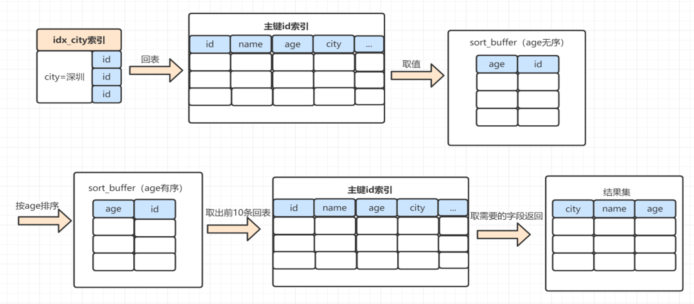
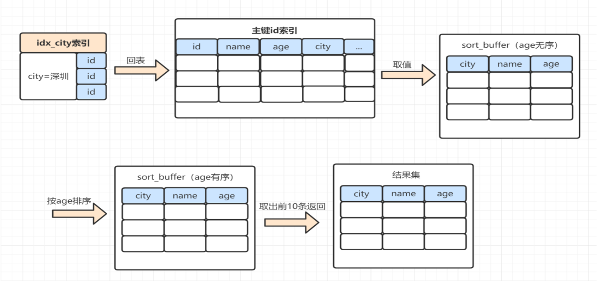

# 慢查询调优总结

## 调优思路
### 开启慢查询日志
```sql
#慢查询记录状态，结果中有show_query_log和show_query_log_file
show variables like 'show_query_log%' 
#慢查询超时时间
show variables like 'long_query_time' 
```

### 查看执行计划
```sql
explain sql
```
重点关注type、key、rows、filtered、extra。
#### type
下表中从上至下，性能从好至坏，一般最低要求range。
| type | 说明 |
| :-: | :- |
| system |  |
| const | 一次索引就能找到，例如主键或唯一索引作为条件 |
| eq_ref | 主键或唯一索引扫描 |
| ref | 非逐渐和唯一索引扫描 |
| ref_or_null | ref的基础上，额外搜索null值 |
| index_merge | 索引合并，查询使用了两个以上的索引 |
| unique_subquery | 类似eq_ref，条件使用in查询 |
| index_subquery | 区别于unique_subquery，用于非唯一索引，可以返回重复值 |
| range | 范围查询，例如 between and 或 in |
| index | 全索引扫描 |
| all | 全表扫描 |

#### rows
**估算**完成查询需要扫描的行数。

#### filtered
存储引擎返回的数据经过过滤后，剩下满足条件记录数量的比例。

#### extra
| 取值 | 说明 |
| :-: | :- |
| Using filesort | 使用外部排序，常见于 order by |
| Using index | 使用覆盖索引 |
| Using temporary | 使用临时表，常见于 group by 或 union |
| Using where |  |
| Using index condition | 使用索引下推 |

### 查看SQL耗时
```sql
# profiling默认关闭
show variables like '%profil%'
set profiling=ON
# 查看历史sql执行时间，默认记录15条，由profiling_history_size指定
show profiles
# 查看最近一条sql各阶段资源消耗
show profile
# 查看指定sql语句分析
show profile for query <id>
show profile cpu,block io for query <id>
```

### 查看Optimizer Trace
profile无法看到真正的执行过程
```sql
set optimizer_trace="enabled=on"
# 最后一条SQL解释优化执行的全过程
select * from information_schema.optimizer_trace
```

### 应对措施
- 多数慢查询跟索引有关，例如索引不生效，需要优化索引
- 优化SQL语句，例如 in 中的元素过多时分批查询，深分页问题等
- SQL没办法优化时，该用ES或者数仓
- 单表数据量过大，考虑分库分表

## 典型场景
- 隐式转换会导致索引失效
- 满足最左匹配原则，联合索引才能生效
- 深分页时 limit m, n 扫描行数多，且扫描到的行需要回表。优化方法：
```sql
# 不允许跳页
select * from account where id > 1000000 limit 10;
# 延迟关联，避免回表
select * from account inner join (select id form account where ... limit 100000, 10);
select * from account where id in (select id form account where ... limit 100000, 10);
```
- in子元素过多时，预估数量并限制

- Order by走文件排序  
数据长度超过max_length_for_sort_data，走rowid排序，否则走全字段排序。可以通过建立索引优化 order by 语句。  
rowid排序需要两次回表

全字段排序需要一次回表

sort_buffer由 sort_buffer_size 参数控制。要排序的数据小于sort_buffer_size，在sort_buffer中完成，否则借助磁盘文件排序。
- 使用 != / <> 或 not in 时不走索引
- join时关联字段类型、编码不同不走索引
- group by后边字段加索引，可以避免使用临时表。尽量只使用临时表，避免filesort。
- delete+in不走索引

