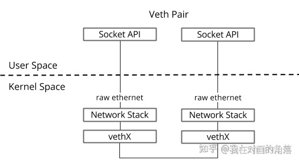

# 容器网络

## 1. 容器网络基础

### 1.1 网络命名空间
- 命名空间有独立的路由表、iptables，命名空间之间是完全隔离的。
- 每个pod是独立的namespace。
- 所有网络设备都只能属于一个命名空间，物理设备只能属于root，虚拟设备可以被关联到指定的命名空间中。
- 在不同命名空间中移动虚拟设备时，会重置虚拟设备的ip等状态。
```bash
# 创建命名空间
ip netns add <ns>
# 获取命名空间列表
ip netns list
# 在命名空间中运行命令
ip netns exec <ns> <command>
# 在命名空间中运行命令
# -t, --target pid：指定被进入命名空间的目标进程的pid
# -m, --mount[=file]：进入mount命令空间。如果指定了file，则进入file的命令空间
# -u, --uts[=file]：进入uts命令空间。如果指定了file，则进入file的命令空间
# -i, --ipc[=file]：进入ipc命令空间。如果指定了file，则进入file的命令空间
# -n, --net[=file]：进入net命令空间。如果指定了file，则进入file的命令空间
# -p, --pid[=file]：进入pid命令空间。如果指定了file，则进入file的命令空间
# -U, --user[=file]：进入user命令空间。如果指定了file，则进入file的命令空间
# -G, --setgid gid：设置运行程序的gid
# -S, --setuid uid：设置运行程序的uid
# -r, --root[=directory]：设置根目录
# -w, --wd[=directory]：设置工作目录
nsenter -u -p -n -t <pid>
# 查看设备是否可以被转移到其他命名空间
ethtool -k <device>
# 将设备移至其他命名空间
ip link set <device> netns <ns>
```

### 1.2 Linux tun/tap
- tun是网络层的虚拟设备，可以收发三层数据报文。常用于点对点ip隧道。
- tap是链路层的虚拟设备，等同于以太网设备。常用语普通机器的虚拟网卡。  
- Linux tun/tap可以通过网络接口和字符设备两种方式进行操作。
```bash
# 创建设备
ip tuntap add dev tap0 mode tap
ip tuntap add dev tun0 mode tun
ip link set tap0 up
ip link set tun0 up
ip addr add <addr>/<mask> dev <device>
# 删除设备
ip tuntap del dev tap0 mode tap
ip tuntap del dev tun0 mode tun
ip link del tap0
ip link del tun0
```

### 1.3 Linux veth pair
veth pair是成对出现的虚拟网络设备，一端连着网络协议栈，一段彼此相连，类似网线，如下图所示。


```bash
# 创建veth pair
ip link add <veth> type veth peer name <peer>
# 将veth移动至其他ns中
ip netns set <veth/peer> netns <ns>
# 启动
ip netns exec <ns> ip link set <veth/peer> up
# 添加地址
ip netns exec <ns> ip addr add <addr>/<mask> dev <devie>
# 设置路由
ip netns exec <ns> ip route add/change <dest>/<mask> via <gateway> dev <device>
```

### 1.4 bridge设备
Linux Bridge是纯软件实现的虚拟交换机，具有二层交换、mac学习等功能，可以把tun/tap，veth pair等设备绑定到网桥上。使用bridge-utils来操作。
```bash
yum install bridge-utils
apt install bridge-utils
# 创建bridge
# 增加Linux Bridge时会自动增加一个同名虚拟网卡在宿主机器上，因此可以通过ip link命令操作这个虚拟网卡，实际上也就是操作网桥，只有当这个网桥处于ip状态时，才会转发数据。
brctl addbr <bridge>
# 将设备添加到bridge
brctl addif <bridge> <device>
# 显示当前存在的网桥及其连接的网络端口
brctl show
# 启动网桥
ip link set <bridge> up
# 删除网桥
ip link set <bridge> down
brctl delbr <bridge>
# 删除网桥
ip link del <bridge>
```

### 1.5 lo设备


## 2. Open vSwitch
OVS是一个用C语言开发的多层虚拟交换机。术语：
- **Bridge 网桥**，以太网交换机。一台主机中可以创建一个或多个Bridge，Bridge根据一定的规则，把某一个端口接收到的报文转发到另一个或多个端口上，也可以修改或者丢弃报文。
- **Port 端口**，类似水晶头。隶属于Bridge，必须先添加Bridge，才能向Bridge上添加Port。Port有以下几种类型：
    - **Normal** 用户可以把操作系统中已有的网卡添加到Open vSwitch上，Open vSwitch会自动生成一个同名的Port来处理这张网卡进和出的数据报文。不过需要注意的是这种方式添加的Port不支持分配IP地址，如果之前网卡上配置的有IP，挂载到OVS上面之后将不可访问。此类型的Port常用于VLAN模式的多台物理主机相连的那个口，交换机一端属于Trunk模式。
    - **Internal** 当Port的类型是Internal时，OVS会自动创建一个虚拟网卡（Interface），此端口收到的数据报文都会转发给这块网卡，从这块网卡发出的数据报文也会通过Port交给OVS处理。当OVS创建一个新的网桥时，会自动创建一个与网桥同名的Internal Port，同时也会创建一个与网桥同名的Interface，因此可以通过ip命令在操作系统中查看到这张虚拟网卡，但是状态是down的。
    - **Patch** Patch Port和veth pair功能相同，总是成双成对的出现，在其中一端收到的数据报文会被转发到另一个Patch Port上，就像是一根网线一样。Patch Port常用于连接两个Bridge，这样两个网桥就和一个网桥一样了。
    - **Tunnel** OVS支持 GRE、VXLAN、STT、Geneve和IPsec隧道协议，这些隧道协议就是overlay网络的基础协议，通过对物理网络做的一层封装和扩展，解决了二层网络数量不足的问题，最大限度的减少对底层物理网络拓扑的依赖性，同时也最大限度的增加了对网络的控制。
- **Interface** 一个接口即是操作系统上的一块网卡，这个网卡可能是OVS生成的虚拟网卡，也有可能是挂载在OVS上的物理网卡，操作系统上的虚拟网卡（TUN/TAP）也可以被挂载在OVS上。
- **Controller** OpenFlow控制器，OVS可以接收一个或者多个OpenFlow控制器的管理，功能主要是下发流表，控制转发规则。
- **Flow** 流表是OVS进行数据转发的核心功能，定义了端口之间转发数据报文的规则，一条流表规则主要分为匹配和动作两部分，匹配部分决定哪些数据报文需要被处理，动作决定了匹配到的数据报文该如何处理。